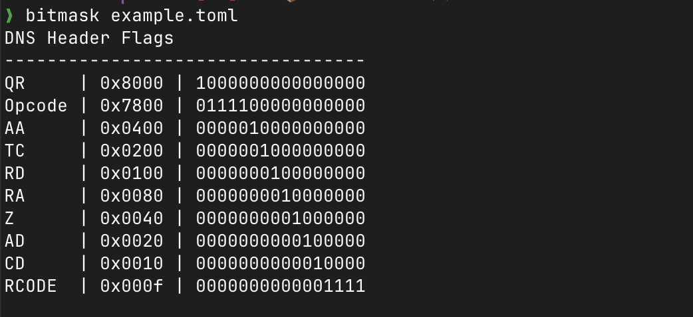

# bitmask

`bitmask` is a dead simple cli that turns a bit layout into the masks you'd
otherwise compute by hand.

You describe the fields of a protocol header (or any packed value) in a TOML
file, and it prints the mask for each field in hex and binary.



## Installation

### Homebrew

```sh
brew install fkhadra/tap/bitmask
```

### Shell installer

Grab the latest release from the [releases page](https://github.com/fkhadra/bitmask/releases)
and run the provided install script, or:

```sh
curl --proto '=https' --tlsv1.2 -LsSf https://github.com/fkhadra/bitmask/releases/latest/download/bitmask-installer.sh | sh
```

Prebuilt binaries are available for macOS (Apple Silicon & Intel), Linux (x86_64 & ARM64),
and Windows (x86_64).

### From source

Requires a recent Rust toolchain (edition 2024).

```sh
git clone https://github.com/fkhadra/bitmask.git
cd bitmask
cargo install --path .
```

## Usage

Point it at a spec file:

```sh
bitmask example.toml
```

```
DNS Header Flags
----------------------------------
QR     | 0x8000 | 1000000000000000
Opcode | 0x7800 | 0111100000000000
AA     | 0x0400 | 0000010000000000
TC     | 0x0200 | 0000001000000000
RD     | 0x0100 | 0000000100000000
RA     | 0x0080 | 0000000010000000
Z      | 0x0040 | 0000000001000000
AD     | 0x0020 | 0000000000100000
CD     | 0x0010 | 0000000000010000
RCODE  | 0x000f | 0000000000001111
```

## Spec file

A spec file holds one or more `[[layout]]` tables. Each layout has a `name`, a
total `width` in bits, and its `fields` listed from the most significant bit
down. Fields are packed in order, so each mask is derived from the bits that
come before it.

```toml
[[layout]]
name  = "DNS Header Flags"
spec  = "Header section format"
url   = "https://www.rfc-editor.org/rfc/rfc1035#section-4.1.1"

width = 16
fields = [
    { name = "QR",     bits = 1  },
    { name = "Opcode", bits = 4  },
    { name = "AA",     bits = 1  },
    { name = "TC",     bits = 1  },
    { name = "RD",     bits = 1  },
    { name = "RA",     bits = 1  },
    { name = "Z",      bits = 1  },
    { name = "AD",     bits = 1  },
    { name = "CD",     bits = 1  },
    { name = "RCODE",  bits = 4  },
]
```

Anything else you add (like `spec` and `url` above) is ignored, so it's a handy
place to keep a link back to the RFC you're reading.

## License

[MIT](LICENSE.md)
